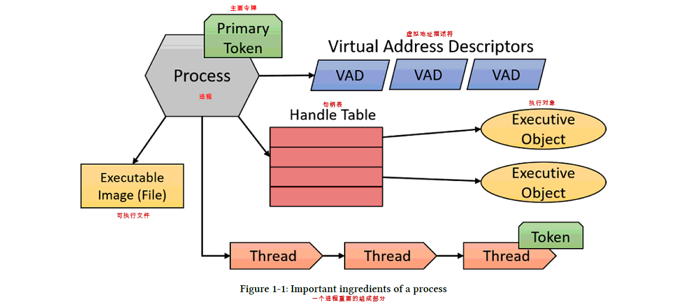
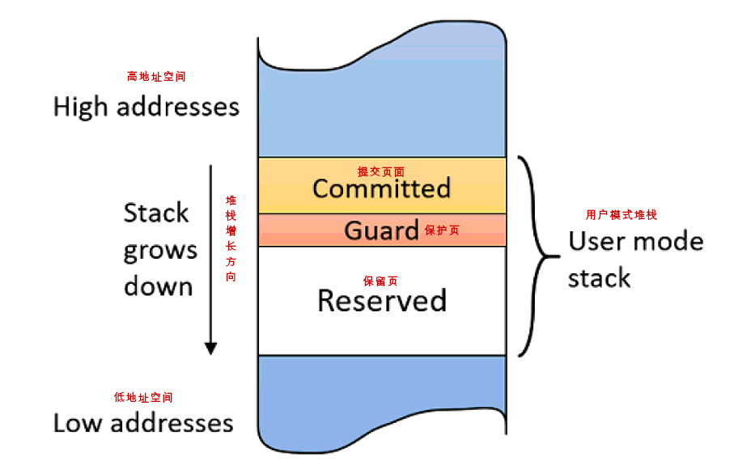
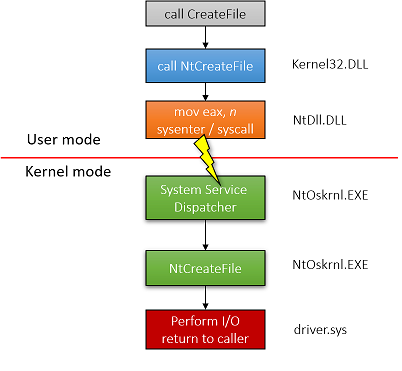
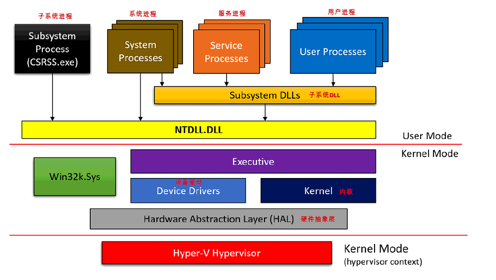
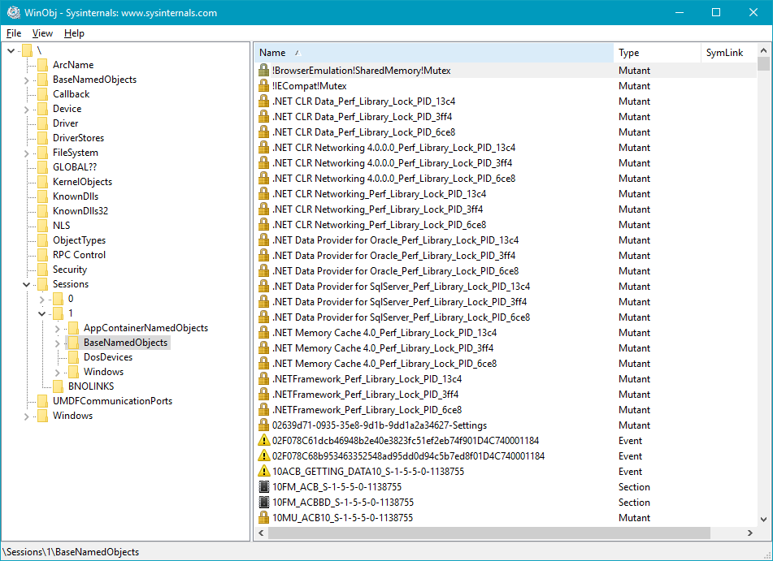
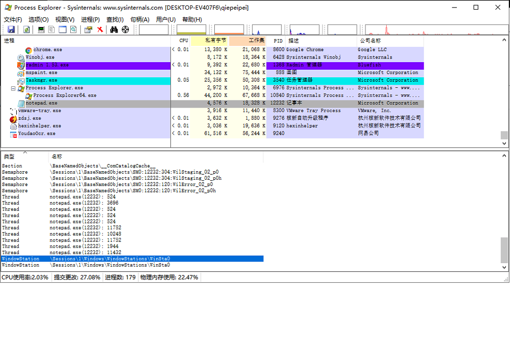

<a href="#1">进程</a>
<a href="#2">虚拟内存</a>
<a href="#3">线程</a>
<a href="#4">系统调用</a>
<a href="#5">Windows系统架构</a>
<a href="#6">句柄和对象</a>

### <a name="1">进程</a>




### <a name="2">虚拟内存</a>

* 对于32位Windows系统上进程，进程地址空间大小默认为2GB

* 如果32位Windows系统上Portable Executable header启用LARGEADDRESSAWARE标记，进程空间大小为3GB, 否则依然为2GB

* 对于64位进程(在64位Windows系统上)，地址空间大小为8TB或128TB (windows8.1及以后版本)

* 对于64位Windows系统上的32位进程，如果Portable Executable header启用LARGEADDRESSAWARE标记，则地址空间大小为4GB。否则，大小仍然是2GB

* 内存管理单元为页面，正常情况下，Windows架构上页面大小为4KB

* 通常CPU会把最近访问的内存地址使用Translation Lookaside Buffer (TLB)进程保存方便下次访问

>   注意
>
>   - 大页面的缺点是需要在RAM中有连续的内存,
>
>   - 如果内存紧张或非常碎片化，内存可能分配会失败。
>
>   - 大页面总是不可分页的，必须仅通过读/写访问进行保护。

- <h4 style="color: #4169E1">页面状态</h4>

    * Free(空闲)  任何访问该页面的尝试都会导致访问冲突异常，因为这些页面没有映射到能够解析该引用的存储位置

    * Reserved(保留)  任何访问该页面的尝试都会导致访问冲突异常，使用VirtualAlloc不会分配该区域内存，不过有办法在该区域分配内存

    * Committed(提交) 可以在没有保护属性的情况下成功访问的已分配页面(写入只读页面会导致访问冲突)。提交的页面通常映射到RAM或文件

- <h4 style="color: #4169E1">系统内存</h4>

    * 32位系统上如果没有增加用户虚拟地址空间设置，操作系统模块驻留在最上层的2GB虚拟地址空间中，从地址0x8000000到0xFFFFFFFF

    * 32位系统上如果设置了增加用户虚拟地址空间，操作系统驻留在剩余的地址空间中。例如：如果系统为每个进程配置了3GB的用户地址空间，则操作系统将取上面的1GB，从地址0xC0000000到0xFFFFFFFF

    * 64位系统上Windows 8、Server 2012和更早版本的64位系统上，操作系统占据了最高8 TB的虚拟地址空间。

    * 64位系统上Windows 8.1、Server 2012 R2及更高版本的64位系统上，操作系统占据了128 TB以上的虚拟地址空间。

>    注意
>
>    - 所有进程共享的系统地址空间,这段地址空间是在内核初始化阶段完成的，也就是每次系统重新启动系统的时候
>
>    - 每个进程都有独立的地址空间,当然这是通过CR3寄存器来区分的
>    
>    - 保护模式下，只有CR3寄存器是存放物理地址的，其他所有都是线性地址


### <a name="3">线程</a>

- <h4 style="color: #4169E1">线程重要信息</h4>

    * 拥有用户访问模式和内核访问模式

    * 执行上下文，包括处理器寄存器和执行状态

    * 一个或两个栈，用于本地变量分配和调用管理

    * 线程本地存储(TLS)数组，它提供了一种以统一访问语义存储线程私有数据的方法

    * 基本优先级和当前(动态)优先级

    * 处理器关联性，指示线程可以在哪个处理器上运行

- <h4 style="color: #4169E1">线程常见状态</h4>

    * 运行 - 正处理器上执行代码
    * 就绪 - 等待调度执行
    * 等待 - 在继续之前等待某个事件发生。一旦事件发生，线程就进入就绪状态

- <h4 style="color: #4169E1">线程堆栈</h4>



* 用户模式堆栈 - 堆栈大小为1MB，是用来存放函数参数和局部变量，处理方式与内核模式堆栈大有不同，开始占用少量内存（可能只有一个页面），其余的堆栈地址空间做为保留内存，不会以任何方式进行分配。在已经提交页面的下一个页面也就是保护页(PAGE_GUARD)进行写入，引发由内存处理的异常,内存管理器删除防护保护并提交页面和标记,将下一个页面做为保护页，这样堆栈就能继续增长。

* 内核模式堆栈 - 堆栈大小为24KB，当线程处于运行或就绪状态时，内核堆栈始终驻留在RAM中。另一方面，用户模式堆栈可能通过页被换出到磁盘，和其他用户模式内存一样，

>    注意
>
>    - PE头中有一个堆栈提交和保留值。如果线程没有指定可选值，则将这些作为默认值
>
>    - 函数CreateThread和CreateRemoteThread(Ex)只允许为堆栈大小指定一个值，可以是提交的大小，也可以是保留的大小，但不能两者都指定。函数NtCreateThreadEx允许同时指定这两个值。

### <a name="4">系统调用</a>



### <a name="5">Windows系统架构</a>



- 用户进程（User Processes） 比如记事本，计算器等

- 子系统DLL（Subsystem DLL） 比如kernel32.dll, user32.dll, gdi32.dll等

- NTDLL.DLL 一个系统级的DLL，实现Windows Native API。这是仍处于用户模式的代码的最低层。它最重要的作用是将系统调用转换到内核模式

- 服务进程（Service Processes） 服务进程是与服务控件进行通信的常规Windows进程

- Executive 是NtOskrnl.exe的上层。 内核模式下它托管了大部分的代码。 它主要包括各种管理器：对象管理器，内存管理器，IO管理器，即插即用管理器，电源管理器，配置管理器等

- 内核（Kernel） 线程调度、中断和异常调度，以及各种如互斥锁和信号量的实现

- 设备驱动（Device Drivers）设备驱动程序是可加载的内核模块。它们的代码以内核模式执行，因此具有内核的全部功能

- Win32k.sys 用于处理Windows的用户界面部分和的图形设备界面（GDI）API。 这意味着所有窗口操作（CreateWindowEx，GetMessage，
PostMessage等）由此组件处理

- 硬件抽象层（Hardware Abstraction Layer） 该层主要用于编写处理硬件设备的设备驱动程序。HAL是最接近CPU的硬件上的一个抽象层。

- 系统进程（System Processes） 比如Smss.exe, Lsass.exe, Winlogon.exe, Services.exe等

- 子系统进程（Subsystem Process）Csrss.exe用于管理在Windows系统下运行的进程的内核。 这是一个关键的进程。

- Hyper-V Hypervisor 运行于Windows 10和server 2016(以及更高版本)系统中，前提是它们支持基于虚拟化的安全(VBS)。VBS提供了一个额外的安全层，其中实际的机器实际上是由Hyper-V控制的虚拟机

### <a name="5">句柄和对象</a>





- <h4 style="color: #4169E1">内核对象简介</h4>

    * 对象种类 - 比较重要的内核对象由：访问令牌对象(access token), 事件对象，文件对象，文件映射对象，IO对象，互斥量对象(mailslot)，进程对象，信号量对象(semaphore)，线程对象等

    * 对象被引用计数 - 只有当对象的最后一个引用被释放时，对象才会被销毁并从内存中释放。

    * 由于这些对象实例驻留在系统空间中，因此不能通过用户模式直接访问它们。

    * 对象句柄 - 用户模式使用对象句柄的进行间接访问。句柄是句柄表中一个条目的索引，该表由当前进程维护，它逻辑上指向驻留在系统空间中的内核对象。有各种Create*和Open*函数来创建/打开对象和检索这些对象的句柄

- <h4 style="color: #4169E1">对象名称</h4>

    * 对象可以使用这些名称通过适当的open函数通过名称打开对象。注意：并非所有对象都有名称，例如：进程和线程没有名称——它们有id。这就是OpenProcess和OpenThread函数需要进程/线程标识符(一个数字)而不是字符串名称的原因。另一种有点奇怪的没有名称的对象是文件。文件名不是对象的名称—它们是不同的概念
    
    * 提供给Create*函数的名称实际上不是对象的最终名称。它的前缀是\Sessions\x\BaseNamedObjects，其中x是调用者的会话ID。如果会话为0，则名称前面加上\BaseNamedObjects\。如果调用者恰好在AppContainer（Win8）中运行(通常是一个通用的Windows平台进程)，那么预写的字符串更加复杂，由唯一的
    AppContainerSID: \Sessions\x\AppContainerNamedObjects\{AppContainerSID}组成。

    * 上图（windows对象管理器）它由命名对象的层次结构组成，整个结构保存在内存中，由对象管理器根据需要进行操作。请注意，未命名的对象（句柄值）不是这个结构的一部分，这意味着在WinObj中看到的对象并不包含所有现有的对象，而是所有使用名称创建的对象

    * 每个进程都有一个专用于内核对象（无论是否命名）的句柄表，可以使用Process Explorer和/或Handles Sysinternals工具进行查看。 

- <h4 style="color: #4169E1">访问现有的对象</h4>

    * 通过一段代码来演示打开句柄和关闭句柄
    ```c++
        bool KillProcess(DWORD pid) {
            //打开一个进程句柄 必须具有 PROCESS_TERMINATE权限
            HANDLE hProcess = OpenProcess(PROCESS_TERMINATE, FALSE, pid);
            if (!hProcess)
            return false;
            // 结束进程
            BOOL success = TerminateProcess(hProcess, 1);
            // 关闭句柄
            CloseHandle(hProcess);
            return success != FALSE;
        }

    ```

    * 通过windbg查看对象引用计数
    ```c++
    lkd> !object 0xFFFFA08F948AC0B0
    Object: ffffa08f948ac0b0 Type: (ffffa08f684df140) Event
    ObjectHeader: ffffa08f948ac080 (new version)
    HandleCount: 2 PointerCount: 65535
    Directory Object: ffff90839b63a700 Name: ShellDesktopSwitchEvent

    lkd> !trueref ffffa08f948ac0b0
    ffffa08f948ac0b0: HandleCount: 2 PointerCount: 65535 RealPointerCount: 3
    ```

    